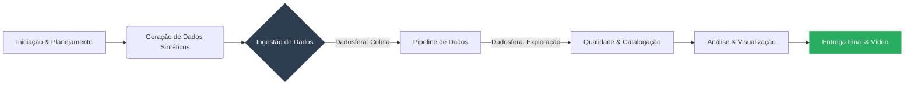

# Case Técnico: Engenharia de Dados Jr - Dadosfera

**Candidato:** [Kevin Richardson dos Santos Meneses]

**Projeto:** Implementação de Plataforma de Dados para Varejo (Adega Local)
---

## 📋 Item 0: Planejamento do Projeto (PMBOK & Agile)

Este projeto visa estruturar a área de dados de um comércio local (Adega e Conveniência) que está iniciando sua transformação digital. O objetivo é centralizar dados de vendas, clientes e estoque para permitir análises descritivas e prescritivas.

O planejamento abaixo segue as fases do ciclo de vida de dados e gerenciamento de projetos, focado na entrega de valor (MVP).

### Fluxo de Trabalho (Macro)

### Backlog de Atividades
FASE 1: Concepção e Dados (Item 1)

   - [x] Definição do Cenário de Negócio (Adega/Varejo).

   - [ ] Criação do Script Python para geração de dados sintéticos (+100k registros).

   - [ ] Validação da consistência dos dados (Vendas, Produtos, Clientes).

FASE 2: Integração e Exploração (Items 2 e 3)

  - [ ] Integração: Carga dos arquivos CSV no módulo de Coleta da Dadosfera.

  - [ ] Catalogação: Criação do Dicionário de Dados e organização nas camadas (Bronze/Silver).

  - [ ] Exploração: Análise inicial dos tipos de dados e volumetria.

FASE 3: Qualidade de Dados (Item 4)

  - [ ] Implementação de checagem de qualidade (Great Expectations ou Soda).

  - [ ] Geração de relatório de inconsistências (ex: valores nulos, duplicatas).

FASE 4: Análise e Valor (Item 7)

  - [ ] Criação do Dataset de Visualização.

  - [ ] Desenvolvimento do Dashboard (Metabase/Dadosfera).

  - [ ] Análise de Categorias.

  - [ ] Análise de Série Temporal (Sazonalidade).

  - [ ] Resposta a 5 perguntas de negócio estratégicas.

FASE 5: Entrega (Item 10)

  - [ ] Gravação do vídeo de apresentação da solução.

  - [ ] Documentação final e organização do repositório.

🛠️ Tecnologias Utilizadas

   Linguagem: Python (Pandas, Faker)

   Plataforma de Dados: Dadosfera

   Qualidade: Great Expectations / Soda

   Visualização: Metabase (integrado à Dadosfera)
