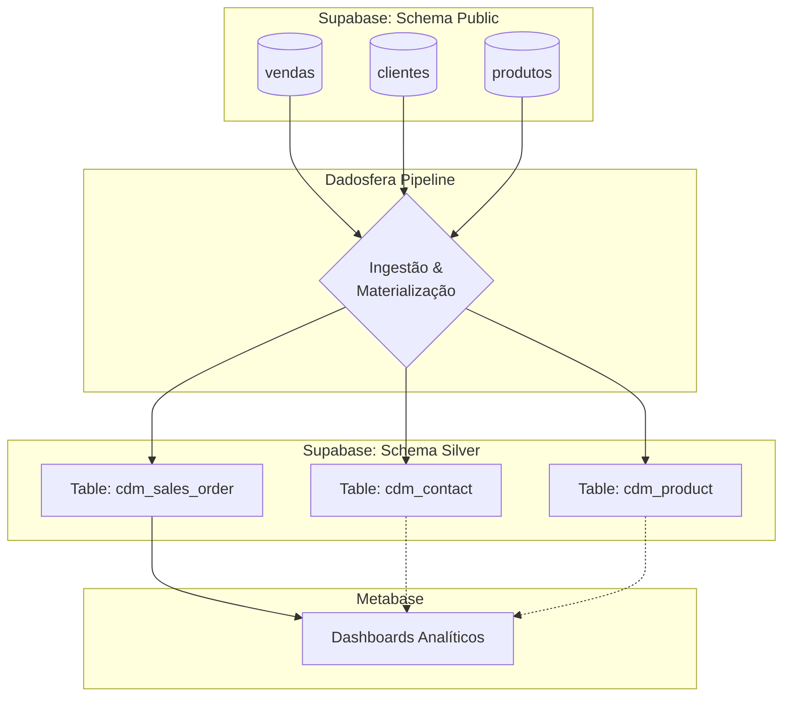

# Case Técnico: Engenharia de Dados Jr - Dadosfera

**Candidato:** Kevin Richardson dos Santos Meneses

**Projeto:** Plataforma de Dados para Varejo 

---
## Sobre o Projeto
Este projeto simula a estruturação da área de dados de um comércio local ("Adega e Conveniência") que está iniciando sua transformação digital. O objetivo foi criar uma **Plataforma de Dados Moderna**, partindo da geração de dados brutos até a entrega de dashboards analíticos, garantindo governança, qualidade e padronização.

    
### 🛠️ Tech Stack

---

## 📋 Item 0: Planejamento (Agile & PMBOK)

Este projeto visa estruturar a área de dados de um comércio local (Adega e Conveniência) que está iniciando sua transformação digital. O objetivo é centralizar dados de vendas, clientes e estoque para permitir análises descritivas e prescritivas.

O planejamento abaixo segue as fases do ciclo de vida de dados e gerenciamento de projetos, focado na entrega de valor (MVP).

### Fluxo de Trabalho (Macro)

### Backlog de Atividades
FASE 1: Concepção e Dados (Item 1)

   - [x] Definição do Cenário de Negócio (Adega/Varejo).

   - [x] Criação do Script Python para geração de dados sintéticos (+100k registros).

   - [x] Validação da consistência dos dados (Vendas, Produtos, Clientes).

FASE 2: Integração e Exploração (Items 2 e 3)

  - [x] Integração: Carga dos arquivos CSV no módulo de Coleta da Dadosfera.

  - [x] Catalogação: Criação do Dicionário de Dados e organização nas camadas (Bronze/Silver).

  - [x] Exploração: Análise inicial dos tipos de dados e volumetria.

FASE 3: Qualidade de Dados (Item 4)

  - [x] Implementação de checagem de qualidade (Great Expectations ou Soda).

  - [x] Geração de relatório de inconsistências (ex: valores nulos, duplicatas).

FASE 4: Análise e Valor (Item 7)

  - [ ] Criação do Dataset de Visualização.

  - [ ] Desenvolvimento do Dashboard (Metabase/Dadosfera).

  - [ ] Análise de Categorias.

  - [ ] Análise de Série Temporal (Sazonalidade).

  - [ ] Resposta a 5 perguntas de negócio estratégicas.

FASE 5: Entrega (Item 10)

  - [ ] Gravação do vídeo de apresentação da solução.

  - [ ] Documentação final e organização do repositório.

## Item 1: Geração de Dados 
Para simular um cenário real de varejo, foi desenvolvido um script Python utilizando a biblioteca Faker e Numpy.

- Volumetria: +115.000 registros de vendas (histórico de 5 anos).

- Lógica de Negócio:

   - Sazonalidade: Picos de vendas aos finais de semana e feriados.

   - Pesos de Probabilidade: Produtos populares (Cervejas Pilsen) vendem mais que produtos de nicho (Artesanais).

   - Cohorts: Base de clientes com datas de cadastro distribuídas ao longo de 11 anos.

- Artifacts: `vendas.csv`, `clientes.csv`, `produtos.csv`
## Item 2 & 3: Integração e Catalogação

A ingestão dos dados foi realizada conectando um banco transacional PostgreSQL (Supabase) à Dadosfera.
Estratégia de Catálogo (Via API)

Como diferencial, a catalogação não foi feita apenas manualmente. Foi desenvolvido um script Python que interage com a API da Dadosfera para:

1. Autenticar via Token.
2. Atualizar descrições técnicas e de negócio.
3. Aplicar tags (landing, varejo, sintético) automaticamente.

## Item 4: Data Quality (Great Expectations)
Antes de disponibilizar os dados para análise, foi implementada uma camada de validação usando a biblioteca Great Expectations.

Principais Regras Validadas:

- ✅ **Unicidade**: id_cliente, id_venda e id_produto não podem ter duplicatas.

- ✅ **Completude**: Não são permitidos valores nulos em campos chaves (nome, categoria).

- ✅ **Consistência**: valor_total deve ser maior que 0.

- ✅ **Formato**: Validação de Regex para e-mails válidos.

    **Resultado**: O dataset atingiu 100% de conformidade com as regras estabelecidas na *Expectation Suite*.

## Item 6: Arquitetura e Modelagem (Silver Layer)

Adotou-se a arquitetura **Medallion (Bronze/Silver/Gold)** com separação lógica por Schemas no banco de dados para garantir organização e segurança.

### Common Data Model (CDM)
Os dados foram mapeados para o padrão CDM para garantir interoperabilidade.

 
🔻 Clique para ver o Mapeamento CDM

    
| Tabela Local | Entidade CDM | Atributo Local | Atributo CDM | Justificativa (Alinhamento CDM) | Tipo CDM Esperado |
| :--- | :--- | :--- | :--- | :--- | :--- |
| **clientes** | **Contact** | `id_cliente` | `ContactNumber` | Identificador único de negócio do cliente no sistema de origem. | String |
| | | `nome` | `FullName` | Nome completo do contato, conforme padrão da entidade Contact. | String |
| | | `email` | `EmailAddress` | Endereço de e-mail primário para comunicação. | String |
| | | `cidade` | `AddressCity` | Município da localização do cliente. | String |
| | | `bairro` | `AddressDistrict` | Bairro ou distrito do endereço. | String |
| | | `data_cadastro` | `CreatedOn` | Data e hora de registro do cliente no sistema. | DateTime |
| **produtos** | **Product** | `id_produto` | `ProductNumber` | Código único (SKU) do produto para identificação de negócio. | String |
| | | `nome` | `ProductName` | Nome comercial ou descrição do produto. | String |
| | | `cat` | `ProductCategory` | Categoria funcional para agrupamento e análise. | String |
| | | `preco` | `DefaultPrice` | Preço de venda padrão do produto. | Decimal (Currency) |
| | | `custo` | `StandardCost` | Custo unitário padrão para formação de preço. | Decimal (Currency) |
| | | `peso` | `Weight` | Peso físico do produto para logística. | Decimal |
| **vendas** | **SalesOrder** | `id_venda` | `SalesOrderNumber` | Número único identificador da transação comercial. | String |
| | | `data_venda` + `hora_venda` | `OrderDate` | Data e hora completa da realização do pedido. | DateTime |
| | | `id_cliente` | `CustomerId` | Referência à chave primária da entidade Contact (cliente). | Guid (FK) |
| | | `id_produto` | `ProductId` | Referência à chave primária da entidade Product (produto). | Guid (FK) |
| | | `quantidade` | `Quantity` | Quantidade de unidades vendidas na linha do pedido. | Decimal |
| | | `valor_unitario` | `UnitPrice` | Preço unitário praticado na transação específica. | Decimal (Currency) |
| | | `valor_total` | `TotalAmount` | Valor total da linha (quantidade × preço unitário). | Decimal (Currency) |

### Estratégia de Materialização (View vs Table)
Inicialmente planejado com Views, optou-se por Materializar a Camada Silver (CREATE TABLE AS) em um schema dedicado (silver).

Motivos da Decisão Técnica:

 - Performance: Criação de Índices e Primary Keys físicas para otimizar consultas no Metabase.

 - Integração: Garantia de visibilidade total pelo conector de pipeline da Dadosfera (que prioriza tabelas físicas).

 - Governança: Separação clara entre dados brutos (public) e dados curados (silver)

